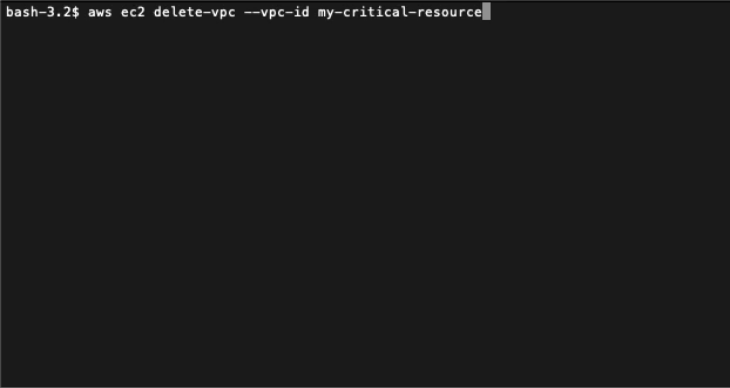

# safeaws-cli



An AWS CLI wrapper that helps you avoid common mistakes and pitfalls with Amazon Bedrock's Large Language Models, checking your command arguments against the command docs.

As an AWS user, sometimes blindly executing CLI commands found online or copied from sources like Stack Overflow can lead to unintended outcomes, data loss, financial loss or security risks. 

`safeaws-cli` empowers you to execute AWS commands confidently by leveraging Amazon Bedrock's AI language models to analyze CLI commands, fetch help text, and identify potential issues or concerns before execution. By providing a safety net that mitigates pitfalls, `safeaws-cli` allows users to explore AWS securely, fostering a more informed approach to working with the CLI.

But of course, running a GenAI model comes with costs. Do evaluate before using it!

## Dependencies

- macOS / Linux
- Python 3.6+
- [boto3](https://pypi.org/project/boto3/) - install with `python3 -m pip install boto3`
- [AWS CLI](https://docs.aws.amazon.com/cli/latest/userguide/getting-started-install.html) (Either Python binding or binary)
- An AWS account with Amazon Bedrock Claude 3 models enabled - refer to `SAFEAWS_BEDROCK_MODEL_ID`.

## Configuration

Variable | Description | Default
---|---|---
`SAFEAWS_AWS_PROFILE` | AWS profile to use | `None`
`SAFEAWS_AWS_REGION` | AWS region to use for Bedrock Model | `us-east-1`
`SAFEAWS_BEDROCK_MODEL_ID` | Bedrock Model ID to use for AI checking | `anthropic.claude-3-haiku-20240307-v1:0`
`SAFEAWS_ANTHROPIC_VERSION` | Anthropic API version | `bedrock-2023-05-31`
`SAFEAWS_MODEL_MAX_TOKENS` | Maximum tokens to generate | `1024`
`SAFEAWS_TEMPERATURE` | Temperature for LLM | `0.5`

For authenticating against Amazon Bedrock, though not recommended, you could also set AWS access key and secret key in the environment variables `AWS_ACCESS_KEY_ID` and `AWS_SECRET_ACCESS_KEY`.

For security, it's recommended to setup an `sso-session` and use the `AWS_PROFILE` environment variable to authenticate.

## Install

```bash
#!/bin/bash
sudo curl https://raw.githubusercontent.com/gabrielkoo/safeaws-cli/main/safeaws.py \
  -o /usr/local/bin/safeaws && \
sudo chmod +x /usr/local/bin/safeaws
```

## Usage

To use `safeaws-cli`, simply prefix your AWS CLI command with `safeaws`:

`safeaws <aws-cli-command>`

For example:

```
> safeaws s3 cp file.txt s3://my-bucket/path/

The provided command appears to be correct and complete. However, here are a few points to consider:

1. Ensure that the file 'file.txt' exists in the local directory from where the command is being executed.

2. Verify that the S3 bucket 'my-bucket' and the 'path/' prefix exist, and that you have the necessary permissions to upload the file to that location.

3. Consider adding the '--acl' parameter to set the appropriate access control list (ACL) for the uploaded object, if required.

4. Evaluate whether any additional metadata, such as content-type or cache-control, should be set for the uploaded object using the respective parameters.

5. Assess if the default storage class ('STANDARD') is appropriate for your use case, and consider using a different storage class if necessary.

Do you want to execute the command? (y/N) y

<Execution results shown here>
```

The script will fetch the help text for the provided AWS CLI command, send it along with the command arguments to the specified Bedrock model, and display any potential issues or concerns identified by the AI. You will then be prompted to confirm whether you want to execute the command or not.
